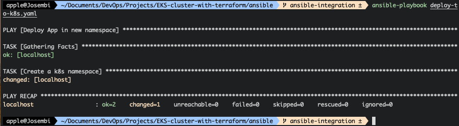
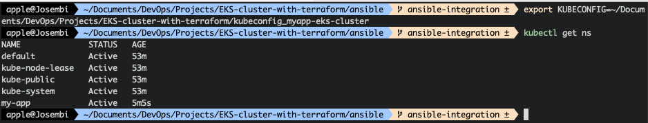
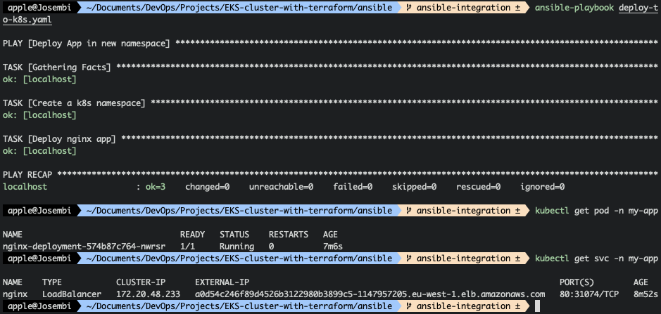
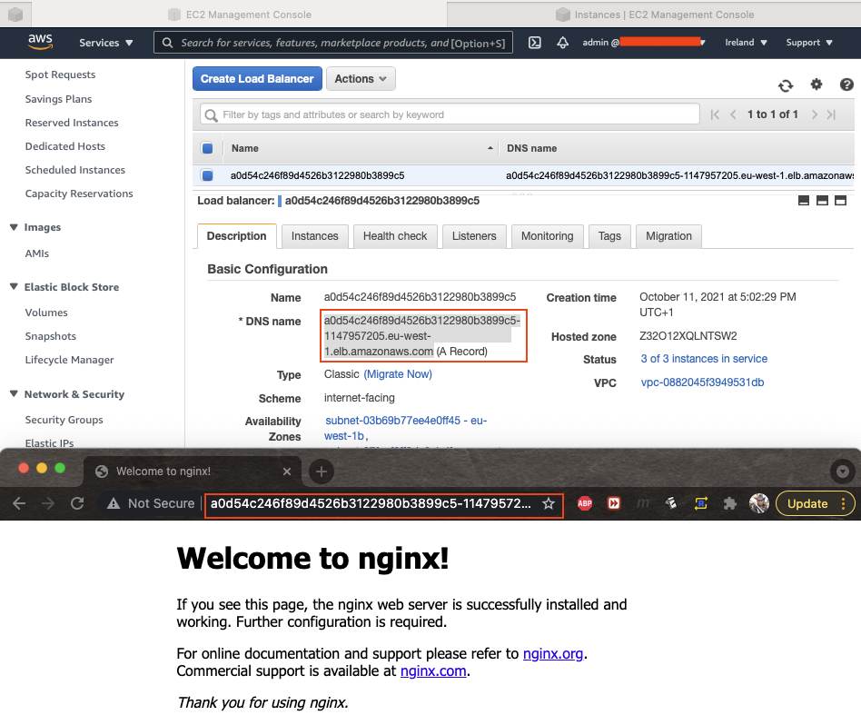

# EKS Cluster With Terraform

<p float="left">
  

  

  
</p>

----

## Overview

I will be integrating Ansible to automate app deployment with EKS and Terraform. I have my environment set up from [this previous project](https://github.com/appwebtech/EKS-Cluster-With-Terraform), so I will execute **terraform apply** to create the cluster.


The next thing to do is to install a the following tools then run the playbook.

1. Openshift
2. PyYAML

The playbook ran successfully, now I'll connect to the cluster and see if the namespace was created.



I'll export the path using Kubeconfig and get the namespaces just so I see if the **my-app** is there.



Because executing k8s works and I have created a namespace, I will actually deploy an application from the k8s config file.

## Deploy App in new Namespace

Below is the Nginx deployment.

```yaml
apiVersion: apps/v1
kind: Deployment
metadata:
  name: nginx-deployment
spec:
  selector:
    matchLabels:
      app: nginx
  replicas: 1 # tells deployment to run 1 pods matching the template
  template:
    metadata:
      labels:
        app: nginx
    spec:
      containers:
      - name: nginx
        image: nginx:1.14.2
        ports:
        - containerPort: 80
---
apiVersion: v1
kind: Service
metadata:
  name: nginx
  labels:
    app: nginx
spec:
  ports:
  - name: http
    port: 80 
    protocol: TCP
    targetPort: 80
  selector:
    app: nginx
  type: LoadBalancer
```

Ansible executed successfully and created the deployment. If I query kubectl to get pod with **my-app namespace** it returns nginx deployment server running. The service is also running of type LoadBalancer which AWS automatically assigned public DNS name to access the service.




