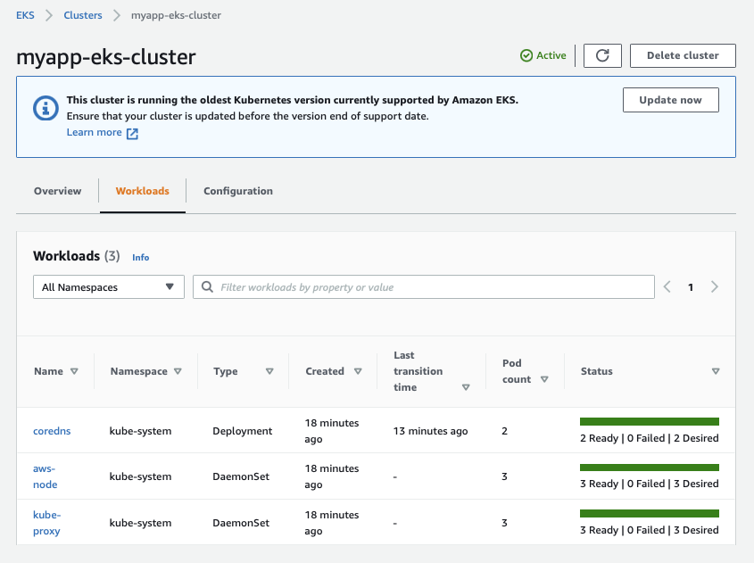

# EKS Cluster With Terraform


<p float="left">
  

  
</p>

----

In this project, I will automate the provisioning of **Elastic Kubernetes Service (EKS) cluster** with **Terraform** *Infrastructure as Code (IaC)*. There are many moving parts (**creation of Roles, VPC Worker Nodes, Master Node {EKS cluster}, connecting kubectl with cluster, Node Groups, Autoscaling and the actual,deployment**) in the manual creation of an EKS cluster which is prone to errors. The best way is to automate the process using Terraform.

----

## Overview

I will need a **Control Plane** (**Master Nodes**) which is the actual EKS service. This is where the **Worker Nodes (WN)** will be managed and applications deployed. The WN will run in a VPC which will house EC2 instances or **Node Group** where the EC2 instances will be installed. The clusters will be created in a specific region, and the nearest region to my home is eu-west-1 (Ireland). eu-west-2 (London) would still work great because the [latency speeds](https://www.awsspeedtest.com/) (based on my location) of the two regions when I tested them oscillate with more or less the same amplitude and period of a cos and sin function; there are some larger spikes during morning hours of weekdays possibly due to people booting their work stations. I'm going off topic, so let me crack on.


## Creating VPC & Resources

I will create the VPC resources with a Terraform module which is much easier as the main configuration is already in the Terraform [vpc registry](https://registry.terraform.io/modules/terraform-aws-modules/vpc/aws/latest?tab=inputs), then I'll just add the resources I need as seen below.

```terraform
provider "aws" {
  region = "eu-west-1"
}

variable "vpc_cidr_block" {}
variable "private_subnet_cidr_blocks" {}
variable "public_subnet_cidr_blocks" {}

data "aws_availability_zones" "azs" {}

module "myapp-vpc" {
  source  = "terraform-aws-modules/vpc/aws"
  version = "3.7.0"

  name            = "myapp-vpc"
  cidr            = var.vpc_cidr_block
  private_subnets = var.private_subnet_cidr_blocks
  public_subnets  = var.public_subnet_cidr_blocks
  azs             = data.aws_availability_zones.azs.names

  enable_nat_gateway   = true
  single_nat_gateway       = true
  enable_dns_hostnames = true

  tags = {
    "kubernetes.io/cluster/myapp-eks-cluster" = "shared"
  }
  public_subnet_tags = {
    "kubernetes.io/cluster/myapp-eks-cluster" = "shared"
    "kubernetes.io/role/elb" = 1
  }
  private_subnet_tags = {
    "kubernetes.io/cluster/myapp-eks-cluster" = "shared"
    "kubernetes.io/role/internal-elb" = 1
  }
}
```


</hr>


## Creating EKS Cluster

Next I'll be creating EKS cluster (Master and Worker Nodes) by leveraging the [Terraform eks module](https://registry.terraform.io/modules/terraform-aws-modules/eks/aws/latest). I want the private subnets to be used for the workload and the public ones for resources like loadbalancer. I'll configure that.

```terraform
module "eks" {
  source  = "terraform-aws-modules/eks/aws"
  version = "17.20.0"

  cluster_name = "myapp-eks-cluster"
  cluster_version = "1.17"
  subnets = module.myapp-vpc.private_subnets
  vpc_id = module.myapp-vpc.vpc_id

  tags = {
      environment = "development"
      application = "myapp"
  }

  worker_groups = [
      {
          instance_type = "t2.small"
          name = "worker-group-1"
          asg_desired_capacity = 2
      },
      {
          instance_type = "t2.medium"
          name = "worker-group-2"
          asg_desired_capacity = 1
      }
  ]

}
```

In order for Terraform to access the cluster, I'll configure the credentials as follows;

```terraform
provider "kubernetes" {
  load_config_file = "false"
  host = data.aws_eks_cluster.myapp-cluster.endpoint
  token = data.aws_eks_cluster_auth.myapp-cluster.token
  cluster_ca_certificate = base64decode(data.aws_eks_cluster.myapp-cluster.certificate_authority.0.data)
}
```

The cluster has been successfully created after around 12 minutes. I defined 2 worker nodes with t2.small EC2 instances and 1 worker node of t2.medium EC2 instance.

```terraform
worker_groups = [
      {
          instance_type = "t2.small"
          name = "worker-group-1"
          asg_desired_capacity = 2
      },
      {
          instance_type = "t2.medium"
          name = "worker-group-2"
          asg_desired_capacity = 1
      }
  ]
```


</hr>

Below are the worker nodes which have been deployed.
 


Checking the Workloads, we can see the Pods have been created and are already running.



</hr>


## Deploying Nginx Server

I used a yaml file to create my nginx deployment with three replicas and after applying the config file, they are up and running.

```yaml
apiVersion: apps/v1
kind: Deployment
metadata:
  name: nginx
spec:
  selector:
    matchLabels:
      app: nginx
  replicas: 1 # tells deployment to run 2 pods matching the template
  template:
    metadata:
      labels:
        app: nginx
    spec:
      containers:
      - name: nginx
        image: nginx
        ports:
        - containerPort: 80
---
apiVersion: v1
kind: Service
metadata:
  name: nginx
  labels:
    app: nginx
spec:
  ports:
  - name: http
    port:80
    protocol: TCP
    targetPort: 80
  selector:
      app: nginx
  type: LoadBalancer
```


And here we have nginx running. There appears to have been a parsing error of my YAML file to JSON due to a typo which actually is not there as my YAML lint parsed my file without errors. Nevertheless the application and service were created successfully.


